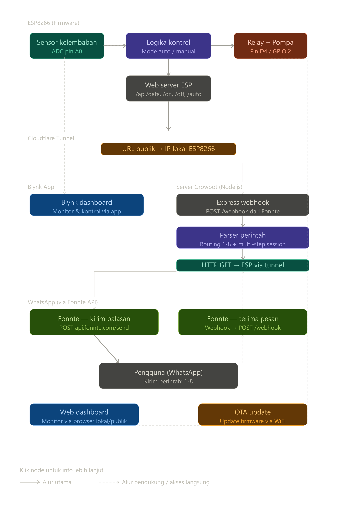

<div align="center">
  
  <h1>Growbot</h1>
  <p>WhatsApp Gateway untuk <a href="https://github.com/hilmyah/Growmate">Growmate</a> — sistem irigasi cerdas berbasis ESP8266</p>
</div>

---

Growbot adalah server perantara berbasis **Node.js** yang menghubungkan WhatsApp (via Fonnte) dengan modul ESP8266 Growmate. Sistem irigasi dapat dipantau dan dikontrol dari jarak jauh hanya dengan mengirim pesan teks biasa.

```
WhatsApp → Fonnte → Growbot (Railway) → Cloudflare Tunnel / Tailscale → ESP8266
```

> Repo firmware dan hardware: [hilmyah/Growmate](https://github.com/hilmyah/Growmate)

---

## Daftar Isi

- [Fitur](#fitur)
- [Cara Kerja Sistem](#cara-kerja-sistem)
- [Struktur Proyek](#struktur-proyek)
- [Persyaratan](#persyaratan)
- [Instalasi](#instalasi)
- [Setup Fonnte](#setup-fonnte)
- [Remote Access](#remote-access)
  - [Opsi A — Cloudflare Tunnel](#opsi-a--cloudflare-tunnel-direkomendasikan)
  - [Opsi B — Tailscale Subnet Router](#opsi-b--tailscale-subnet-router)
- [Deploy ke Railway](#deploy-ke-railway)
- [Menjalankan Secara Lokal](#menjalankan-secara-lokal)

---

## Fitur

| Perintah | Fungsi |
|:---:|---|
| `1` | Status terkini — ADC, kelembaban %, kondisi tanah, mode, threshold, waktu terakhir disiram |
| `2` | Nyalakan pompa manual (mati otomatis dalam 60 detik) |
| `3` | Matikan pompa manual |
| `4` | Aktifkan mode otomatis — pompa bekerja berdasarkan threshold |
| `5` | Atur nilai threshold kelembaban (input multi-step, rentang 200–1024) |
| `6` | Tambah preset tanaman baru (nama + threshold, input multi-step) |
| `7` | Riwayat 5 data kelembaban terakhir beserta persentasenya |
| `8` | Jumlah sesi penyiraman hari ini |

Menu perintah dikirimkan otomatis di setiap balasan sehingga pengguna tidak perlu menghapal.

---

## Cara Kerja Sistem



Alur singkat:

1. **ESP8266** membaca kelembaban tanah via ADC dan menjalankan web server HTTP lokal.
2. **Cloudflare Tunnel / Tailscale** mengekspos IP lokal ESP8266 ke internet secara aman.
3. **Growbot** (di Railway) menerima pesan dari Fonnte melalui webhook, memparsing perintah, lalu memanggil endpoint ESP melalui URL tunnel.
4. **Fonnte** meneruskan balasan dari Growbot ke WhatsApp pengguna.

---

## Struktur Proyek

```
growbot/
├── asset/
│   ├── growmate.png      # Logo proyek
│   └── growmate.svg      # Logo versi vektor
├── index.js              # Server utama — webhook, routing perintah, komunikasi ESP
├── package.json
├── package-lock.json
├── .env.example          # Template variabel environment
└── .gitignore
```

### Penjelasan `index.js`

| Bagian | Keterangan |
|---|---|
| `sessions` | Object in-memory untuk menyimpan state percakapan multi-step (threshold, preset) |
| `menuText()` | Generator teks menu yang disisipkan di setiap balasan |
| `sendWA(to, msg)` | Mengirim pesan ke nomor WhatsApp tertentu via Fonnte API |
| `getESPData()` | `GET /api/data` ke ESP — mengambil status sensor, pompa, mode, dan threshold |
| `cmdESP(path)` | `GET {path}` ke ESP — mengirim perintah seperti `/on`, `/off`, `/auto` |
| `POST /webhook` | Endpoint utama yang menerima pesan masuk dari Fonnte dan memroses perintah |

---

## Persyaratan

- Node.js v16 atau lebih baru
- Akun [Fonnte](https://fonnte.com) dengan device WhatsApp aktif
- Firmware Growmate sudah berjalan di ESP8266 (lihat [hilmyah/Growmate](https://github.com/hilmyah/Growmate))
- `cloudflared` **atau** Tailscale terinstal di komputer yang satu jaringan dengan ESP8266

---

## Instalasi

**1. Clone repo dan install dependensi**

```bash
git clone https://github.com/hilmyah/Growbot.git
cd Growbot
npm install
```

**2. Salin dan isi file environment**

```bash
cp .env.example .env
```

Edit `.env` dan isi nilainya:

```ini
FONNTE_TOKEN=token_dari_dashboard_fonnte
ESP_URL=https://url-tunnel.trycloudflare.com
PORT=3000
```

---

## Setup Fonnte

Fonnte berfungsi sebagai jembatan antara WhatsApp dan server Growbot.

1. Buka [fonnte.com](https://fonnte.com) dan buat akun.
2. Di dashboard, pilih **Tambah Device** → scan QR Code menggunakan WhatsApp yang akan dijadikan bot.
3. Salin **Token** yang muncul, masukkan ke `FONNTE_TOKEN` di file `.env`.
4. Setelah server Growbot di-deploy (lihat bagian [Deploy ke Railway](#deploy-ke-railway)), buka pengaturan device di Fonnte dan isi kolom **Webhook URL**:
   ```
   https://nama-app.up.railway.app/webhook
   ```
5. Kirim pesan apa saja ke nomor bot untuk memastikan webhook aktif.

---

## Remote Access

Server Growbot yang berjalan di Railway tidak dapat langsung menjangkau ESP8266 di jaringan lokal. Gunakan salah satu metode di bawah pada komputer yang **terhubung ke WiFi yang sama dengan ESP8266** dan biarkan berjalan selama sistem digunakan.

### Opsi A — Cloudflare Tunnel (Direkomendasikan)

Tidak memerlukan akun, URL publik langsung aktif tanpa konfigurasi port forwarding.

**Instalasi `cloudflared`:**

```bash
# macOS
brew install cloudflared

# Windows (via winget)
winget install Cloudflare.cloudflared

# Linux (Debian/Ubuntu)
curl -L https://pkg.cloudflare.com/cloudflared-stable-linux-amd64.deb -o cloudflared.deb
sudo dpkg -i cloudflared.deb
```

**Jalankan tunnel:**

```bash
cloudflared tunnel --url http://192.168.X.X
# Ganti dengan IP ESP8266 yang tampil di Serial Monitor Arduino IDE
```

URL publik akan muncul di terminal:
```
https://random-name.trycloudflare.com
```

Salin URL ini ke `ESP_URL` di file `.env` atau variabel Railway.

> **Catatan:** URL berubah setiap kali `cloudflared` dijalankan ulang. Untuk URL permanen, daftar akun Cloudflare gratis dan buat [Named Tunnel](https://developers.cloudflare.com/cloudflare-one/connections/connect-networks/).

---

### Opsi B — Tailscale Subnet Router

Cocok jika akses ingin dibatasi hanya ke anggota tim atau perangkat tertentu. Tidak ada URL publik — koneksi lewat jaringan privat Tailscale.

**Instalasi Tailscale:** unduh di [tailscale.com/download](https://tailscale.com/download).

**Aktifkan subnet routing** di komputer yang satu jaringan dengan ESP8266:

```bash
# Linux / macOS
sudo tailscale up --advertise-routes=192.168.1.0/24

# Windows (PowerShell sebagai Administrator)
tailscale up --advertise-routes=192.168.1.0/24
```

Sesuaikan `192.168.1.0/24` dengan subnet WiFi yang digunakan (cek dengan `ipconfig` / `ip a`).

Setelah itu:

1. Buka [Tailscale Admin Console](https://login.tailscale.com/admin/machines).
2. Temukan perangkat yang baru terhubung → klik **Edit route settings** → aktifkan subnet yang diiklankan.
3. Pastikan server Railway juga terdaftar di akun Tailscale yang sama (atau gunakan Tailscale Auth Key untuk otomasi).

Gunakan IP lokal ESP8266 sebagai `ESP_URL`:
```ini
ESP_URL=http://192.168.1.X
```

---

## Deploy ke Railway

Railway menjalankan Growbot secara permanen di cloud tanpa perlu menyalakan komputer sendiri.

1. Push repo ini ke GitHub (fork atau clone ke akun kamu).
2. Buka [railway.app](https://railway.app) → **New Project** → **Deploy from GitHub Repo**.
3. Pilih repo `Growbot`.
4. Buka tab **Variables** di Railway dan tambahkan:

   | Key | Value |
   |---|---|
   | `FONNTE_TOKEN` | Token dari Fonnte |
   | `ESP_URL` | URL Cloudflare Tunnel atau IP via Tailscale |
   | `PORT` | `3000` |

5. Railway otomatis menjalankan `npm start` setelah deploy selesai.
6. Salin **URL domain Railway** yang diberikan (contoh: `https://growbot-production.up.railway.app`).
7. Tempel URL tersebut ditambah `/webhook` ke kolom Webhook URL di Fonnte (lihat [Setup Fonnte](#setup-fonnte)).

---

## Menjalankan Secara Lokal

```bash
npm start
```

Server berjalan di `http://localhost:3000`. Untuk menerima webhook dari Fonnte saat pengembangan lokal, buat URL publik sementara:

```bash
# Menggunakan cloudflared
cloudflared tunnel --url http://localhost:3000

# Atau menggunakan ngrok
ngrok http 3000
```

Gunakan URL yang dihasilkan sebagai Webhook URL di Fonnte sementara pengujian berlangsung.

---

<div align="center">
  <sub>Growbot merupakan bagian dari proyek <a href="https://github.com/hilmyah/Growmate">Growmate</a> — Smart Irrigation System berbasis ESP8266.</sub>
</div>